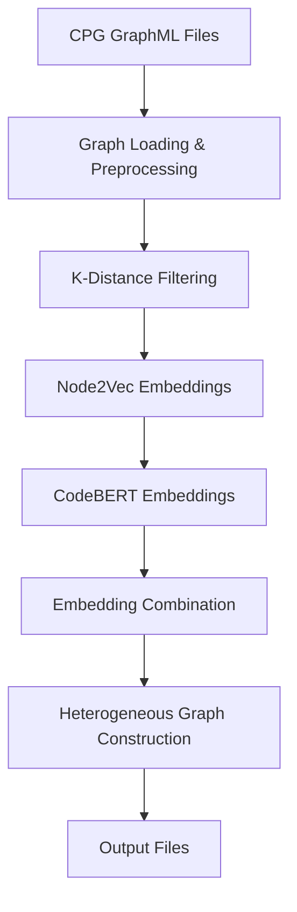

# Node Embeddings Package for Code Property Graphs

A comprehensive Python package for generating, processing, and managing node embeddings from Code Property Graphs (CPGs) using multiple embedding techniques including Word2Vec, Node2Vec, and CodeBERT.

## Features

- **Multi-Modal Embeddings**: Combines Word2Vec, Node2Vec, and CodeBERT for comprehensive code representation
- **Graph Processing**: Intelligent k-distance filtering and heterogeneous graph construction
- **Batch Processing**: Efficient processing of large graphs with configurable batch sizes
- **Parallel Execution**: Multi-project processing with configurable parallelism
- **Flexible Configuration**: Environment variable and file-based configuration support
- **Comprehensive Validation**: Input validation, graph structure validation, and embedding validation
- **Multiple Output Formats**: Heterogeneous graphs, combined embeddings, and statistics

## Installation

### Prerequisites

- Python 3.8+
- PyTorch 1.12+
- CUDA support (optional, for GPU acceleration)

### Install Dependencies

```bash
pip install -r requirements.txt
```

### Install Package

```bash
# From source
pip install -e .

# Or copy the package to your project
cp -r node_embeddings /path/to/your/project/
```

## Quick Start

### Basic Usage

```python
from node_embeddings import EmbeddingGenerator, EmbeddingConfig

# Initialize with default configuration
generator = EmbeddingGenerator()

# Generate embeddings for a single commit
result = generator.generate_embeddings_for_commit(
    "path/to/before.graphml",
    "path/to/after.graphml"
)

# Generate embeddings for a project
project_result = generator.generate_embeddings_for_project("commons-codec")

# Generate embeddings for multiple projects
all_results = generator.generate_embeddings_for_projects(parallel=True)
```

### Custom Configuration

```python
from node_embeddings import EmbeddingConfig

# Create custom configuration
config = EmbeddingConfig(
    data_dir="/path/to/data",
    output_dir="/path/to/output",
    word2vec_vector_size=256,
    node2vec_dimensions=256,
    codebert_batch_size=16,
    device="cuda"
)

# Initialize generator with custom config
generator = EmbeddingGenerator(config)
```

### Environment Variables

```bash
export EMBEDDING_DATA_DIR="/path/to/data"
export EMBEDDING_OUTPUT_DIR="/path/to/output"
export EMBEDDING_DEVICE="cuda"
export EMBEDDING_WORD2VEC_SIZE="256"
export EMBEDDING_NODE2VEC_DIM="256"
export EMBEDDING_CODEBERT_BATCH="16"
export EMBEDDING_MAX_WORKERS="8"
```

## Architecture

### Core Components

1. **EmbeddingGenerator**: Main orchestrator class
2. **Word2VecEmbedder**: Semantic embeddings from node features
3. **Node2VecEmbedder**: Structural embeddings from graph topology
4. **CodeBERTEmbedder**: Advanced semantic embeddings using pre-trained models
5. **EmbeddingProcessor**: Embedding combination and heterogeneous graph construction
6. **EmbeddingConfig**: Centralized configuration management

### Embedding Pipeline



## Configuration

### Default Settings

```python
@dataclass
class EmbeddingConfig:
    # Paths
    data_dir: str = "/workspace/s2156631-thesis/data"
    output_dir: str = "/workspace/s2156631-thesis/embeddings"
    
    # Word2Vec
    word2vec_vector_size: int = 128
    word2vec_window: int = 10
    word2vec_workers: int = 4
    word2vec_epochs: int = 5
    
    # Node2Vec
    node2vec_dimensions: int = 128
    node2vec_walk_length: int = 30
    node2vec_num_walks: int = 200
    node2vec_workers: int = 8
    
    # CodeBERT
    codebert_batch_size: int = 32
    codebert_max_tokens: int = 512
    
    # Processing
    k_distance_levels: List[int] = [0, 1]
    max_workers: int = 8
    device: str = "auto"
```

### Supported Projects

The package includes support for 20+ Java projects:

- Apache Commons (codec, collections, compress, configuration, dbcp, digester, io, jcs, lang, math, net, scxml, validator, vfs)
- Apache Ant-IVY
- Apache BCEL
- Apache BeanUtils
- Apache Giraph
- Apache Gora
- Apache OpenNLP
- Apache Parquet-MR

## Usage Examples

### Single Commit Processing

```python
from node_embeddings import EmbeddingGenerator

generator = EmbeddingGenerator()

# Process a single commit
result = generator.generate_embeddings_for_commit(
    "commons-codec_before.graphml",
    "commons-codec_after.graphml"
)

if result['status'] == 'success':
    print(f"Generated embeddings for {result['total_nodes_processed']} nodes")
    print(f"Output files: {result['hetero_data_files']}")
else:
    print(f"Error: {result['error']}")
```

### Project-Wide Processing

```python
# Process all commits in a project
project_result = generator.generate_embeddings_for_project("commons-codec")

print(f"Project {project_result['project']}:")
print(f"  Total files: {project_result['total_files']}")
print(f"  Successful: {project_result['successful']}")
print(f"  Failed: {project_result['failed']}")
```

### Multi-Project Processing

```python
# Process multiple projects in parallel
all_results = generator.generate_embeddings_for_projects(
    project_names=["commons-codec", "commons-lang", "commons-math"],
    parallel=True
)

for project, result in all_results['results'].items():
    print(f"{project}: {result['status']}")
```

### Word2Vec Training

```python
# Train Word2Vec model on node features
file_paths = ["project1_commit1", "project1_commit2", "project2_commit1"]
model_path = generator.train_word2vec_model(file_paths)

# Load pre-trained model
generator.load_word2vec_model(model_path)
```

### Custom Embedding Generation

```python
from node_embeddings import Word2VecEmbedder, Node2VecEmbedder

# Custom Word2Vec parameters
word2vec = Word2VecEmbedder()
model = word2vec.train_word2vec_model(
    file_paths,
    vector_size=256,
    window=15,
    workers=8,
    epochs=10
)

# Custom Node2Vec parameters
node2vec = Node2VecEmbedder()
embeddings = node2vec.generate_embeddings(
    graph,
    dimensions=256,
    walk_length=50,
    num_walks=300,
    workers=12
)
```

## Output Formats

### 1. Combined Embeddings

Text file with format: `node_id embedding_vector`

```
node1 0.123 -0.456 0.789 ...
node2 0.234 -0.567 0.890 ...
```

### 2. Heterogeneous Graph Data

PyTorch Geometric HeteroData objects saved as `.pt` files:

- Node features with type-specific indexing
- Edge indices with type information
- Multiple k-distance levels (k=0, k=1)

### 3. Statistics and Reports

```python
# Get embedding statistics
stats = generator.processor.get_embedding_statistics(embeddings)
print(f"Node types: {stats['node_types']}")
print(f"State distribution: {stats['state_distribution']}")

# Get graph statistics
graph_stats = generator.processor.get_graph_statistics(graph)
print(f"Total nodes: {graph_stats['total_nodes']}")
print(f"Total edges: {graph_stats['total_edges']}")
```

## Performance Considerations

### Optimization Strategies

1. **Batch Processing**: CodeBERT embeddings generated in batches
2. **Parallel Processing**: Multi-worker execution for Node2Vec and Word2Vec
3. **Memory Management**: Efficient tensor operations and cleanup
4. **GPU Acceleration**: CUDA support for CodeBERT inference

### Resource Requirements

- **GPU**: 8GB+ VRAM recommended for CodeBERT
- **RAM**: 16GB+ for large graphs
- **Storage**: Sufficient space for embedding files

### Scalability

- **Large Graphs**: Handles CPGs with thousands of nodes
- **Multiple Projects**: Processes 20+ projects efficiently
- **Parallel Execution**: Configurable worker counts

## Validation and Quality

### Input Validation

```python
# Validate setup
validation = generator.validate_setup()
if not validation['is_valid']:
    print("Setup validation failed:")
    for error in validation['errors']:
        print(f"  - {error}")

# Validate embeddings
embedding_validation = generator.processor.validate_embeddings(embeddings)
print(f"Valid nodes: {embedding_validation['valid_nodes']}")
```

### Graph Validation

```python
from node_embeddings import validate_graph_structure

# Validate CPG structure
validation = validate_graph_structure(graph)
if validation['is_valid']:
    print("Graph structure is valid")
else:
    print("Graph validation issues:")
    for error in validation['errors']:
        print(f"  - {error}")
```

## Error Handling

### Common Issues

1. **Memory Errors**: Reduce batch size or use CPU processing
2. **File Not Found**: Verify GraphML file paths and format
3. **Model Loading**: Check CodeBERT model path and accessibility
4. **GPU Issues**: Verify CUDA installation and memory availability

### Debugging

```python
# Enable detailed logging
import logging
logging.basicConfig(level=logging.DEBUG)

# Get detailed error information
try:
    result = generator.generate_embeddings_for_commit(before_file, after_file)
except Exception as e:
    print(f"Error details: {e}")
    import traceback
    traceback.print_exc()
```

## Integration

### Machine Learning Pipelines

```python
# Load generated embeddings for training
from node_embeddings import load_embeddings

embeddings = load_embeddings("path/to/embeddings.txt")
hetero_data = generator.processor.load_heterogeneous_data("path/to/hetero_data.pt")

# Use in PyTorch Geometric models
model = YourGNNModel()
output = model(hetero_data)
```

### Custom Extensions

```python
# Extend the package with custom embedders
from node_embeddings import EmbeddingGenerator

class CustomEmbedder:
    def generate_embeddings(self, graph):
        # Custom embedding logic
        pass

# Integrate with main generator
generator.custom_embedder = CustomEmbedder()
```

## Contributing

### Development Setup

```bash
# Clone repository
git clone <repository-url>
cd node_embeddings

# Install development dependencies
pip install -r requirements.txt
pip install pytest black flake8

# Run tests
pytest tests/

# Format code
black .
flake8 .
```

### Code Style

- Follow PEP 8 guidelines
- Use type hints
- Include comprehensive docstrings
- Add unit tests for new features

## License

This package is part of the Thesis Dataset project and follows the same licensing terms.

## Support

For issues and questions:

1. Check the documentation and examples
2. Review error messages and validation results
3. Verify configuration and file paths
4. Check system requirements and dependencies

## Changelog

### Version 1.0.0
- Initial release with Word2Vec, Node2Vec, and CodeBERT support
- Comprehensive configuration management
- Multi-project processing capabilities
- Heterogeneous graph construction
- Extensive validation and error handling
